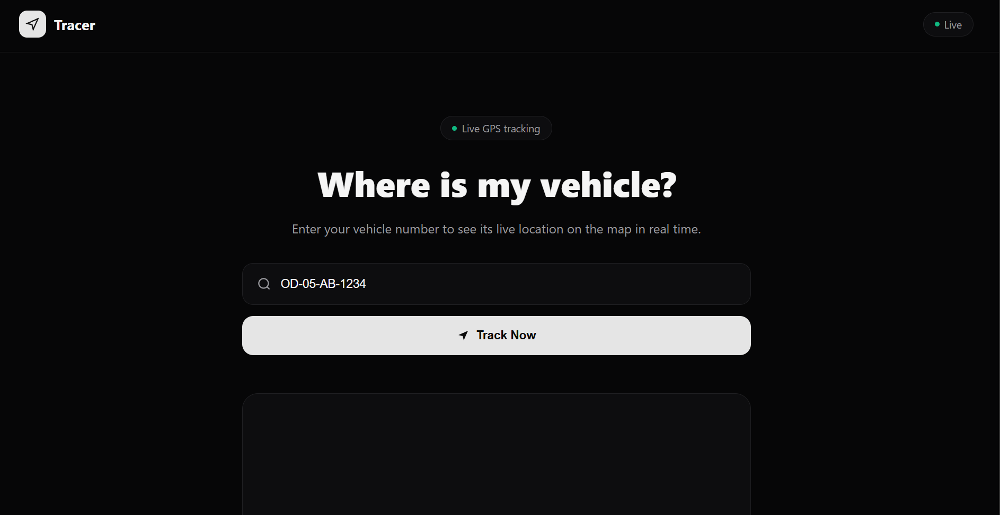
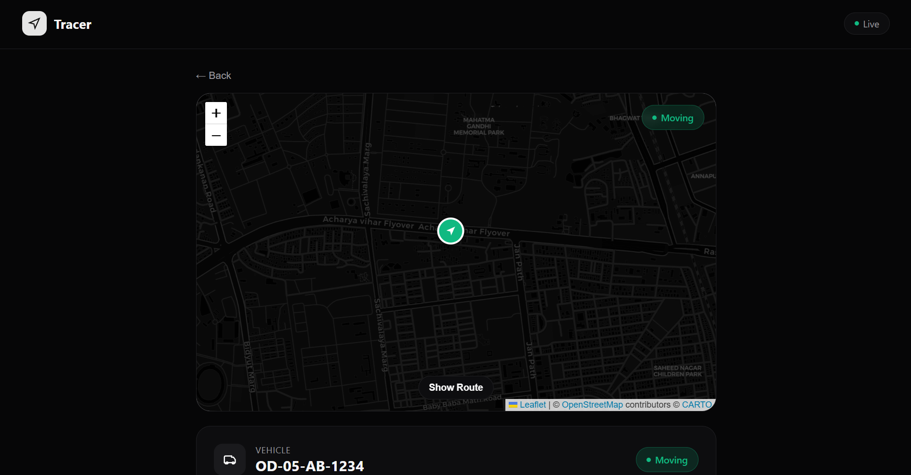
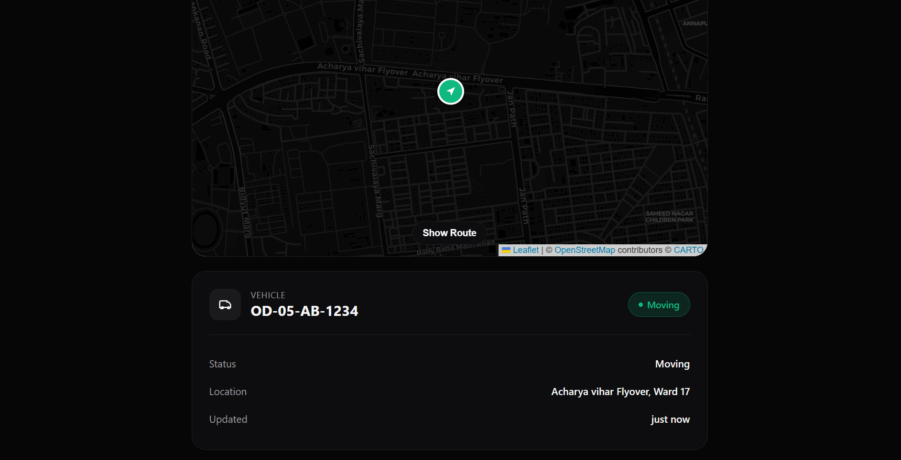

# 🚗 Real-Time Vehicle Tracking System

A full-stack vehicle tracking application that simulates and visualizes live vehicle movement using real-time GPS updates.

## 📸 Project Preview







## ✨ Features

- 🔴 Real-time vehicle location updates every 3 seconds
- 🗺️ Interactive map-based vehicle tracking
- 🚗 Track vehicles using their vehicle number
- ⚡ Real-time communication using STOMP over WebSocket
- 📍 Live vehicle markers using Leaflet
- 🛣️ Route history visualization
- 📊 Vehicle status and location information
- 🛡️ Geofence creation and monitoring
- 🚨 Overspeed detection with an 80 km/h threshold
- 💾 Persistent GPS route history using PostgreSQL
- 🔄 RESTful APIs for vehicle and geofence management

  ## 🛠️ Tech Stack

### Backend
- Java
- Spring Boot
- Spring Data JPA
- REST APIs
- WebSocket
- STOMP / SockJS

### Frontend
- React
- Leaflet

### Database
- PostgreSQL

### Development Tools
- Git
- GitHub
- Maven
- IntelliJ IDEA
- Postman

  ## 🏗️ How It Works

The application follows a client-server architecture:

1. Vehicle information is managed by the Spring Boot backend.
2. REST APIs handle vehicle data and lifecycle operations.
3. Vehicle coordinates are generated and updated periodically.
4. The backend broadcasts real-time location updates using STOMP over WebSocket.
5. The React frontend receives these updates without requiring a page refresh.
6. Leaflet updates the vehicle marker on the map based on the latest coordinates.
7. Historical GPS coordinates are stored in PostgreSQL and can be used to visualize the vehicle's route.

   ```text
                 ┌─────────────────────┐
                 │    React Frontend    │
                 │                     │
                 │   Leaflet Map       │
                 └──────────┬──────────┘
                            │
                    REST / WebSocket
                            │
                            ▼
                 ┌─────────────────────┐
                 │    Spring Boot      │
                 │                     │
                 │ REST APIs           │
                 │ WebSocket / STOMP   │
                 │ Spring Data JPA     │
                 └──────────┬──────────┘
                            │
                            ▼
                 ┌─────────────────────┐
                 │     PostgreSQL      │
                 │                     │
                 │ Vehicle Data        │
                 │ GPS Route Points    │
                 └─────────────────────┘

   ## 📂 Project Structure

```text
Vehicle-Tracker/
├── frontend/
│   ├── public/
│   ├── src/
│   ├── package.json
│   └── package-lock.json
│
├── src/
│   ├── main/
│   └── test/
│
├── pom.xml
├── mvnw
├── mvnw.cmd
├── package.json
├── package-lock.json
└── README.md

## 🚀 Getting Started

### Prerequisites

Make sure you have the following installed:

- Java 21 or later
- Node.js and npm
- PostgreSQL
- Git

### 1. Clone the repository

```bash
git clone https://github.com/soham-29B/Vehicle-Tracker.git
cd Vehicle-Tracker
### 2. Set up PostgreSQL

Create a PostgreSQL database named `vehicle_tracker`.

The application connects to PostgreSQL at:

```text
localhost:5432/vehicle_tracker

## 🔌 API & Real-Time Communication

### REST API

The backend exposes RESTful APIs for managing vehicles, routes, and geofences.

#### Vehicle Endpoints

| Method | Endpoint | Description |
|--------|----------|-------------|
| `GET` | `/api/vehicles` | Retrieve all vehicles |
| `POST` | `/api/vehicles` | Add a new vehicle |
| `GET` | `/api/vehicles/{id}` | Retrieve a vehicle by ID |
| `PUT` | `/api/vehicles/{id}` | Update a vehicle |
| `DELETE` | `/api/vehicles/{id}` | Delete a vehicle |
| `GET` | `/api/vehicles/{id}/route` | Retrieve the vehicle's route history |

#### Geofence Endpoints

| Method | Endpoint | Description |
|--------|----------|-------------|
| `POST` | `/api/geofences` | Create a geofence |
| `GET` | `/api/geofences` | Retrieve all geofences |
| `GET` | `/api/geofences/{id}` | Retrieve a geofence and its points |
| `DELETE` | `/api/geofences/{id}` | Delete a geofence |

### WebSocket Communication

The application uses STOMP over WebSocket for real-time communication between the backend and frontend.

- **WebSocket endpoint:** `/ws`
- **Message broker prefix:** `/topic`
- **Application destination prefix:** `/app`
- **SockJS:** Enabled for WebSocket communication fallback

This allows the frontend to receive real-time updates without repeatedly refreshing or polling the server.

### Real-Time GPS Data Flow

```text
GPS Simulator
      │
      │ Every 3 seconds
      ▼
GpsSimulatorService
      │
      ├── Updates vehicle coordinates
      ├── Saves GPS route point
      ├── Checks geofences
      ├── Calculates speed
      └── Checks overspeeding
      │
      ▼
SimpMessagingTemplate
      │
      │ STOMP over WebSocket
      ▼
/topic/vehicles
      │
      ▼
React TrackerPage
      │
      ├── Filters selected vehicle
      ├── Updates vehicle state
      └── Updates route points
      │
      ▼
Leaflet Map

## 🔮 Future Improvements

- Docker-based deployment
- Enhanced UI and user experience
- Production deployment
